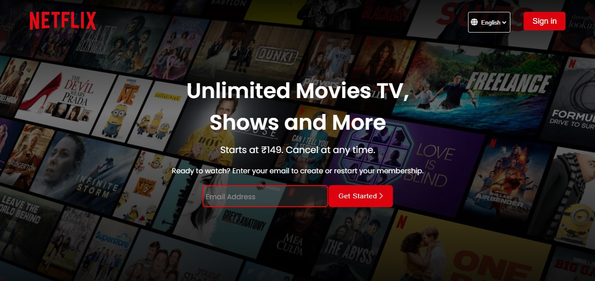
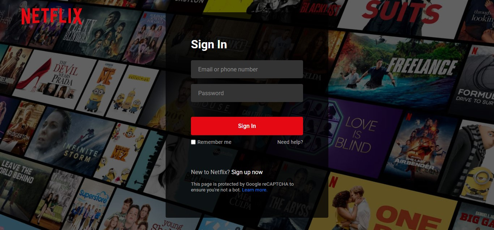
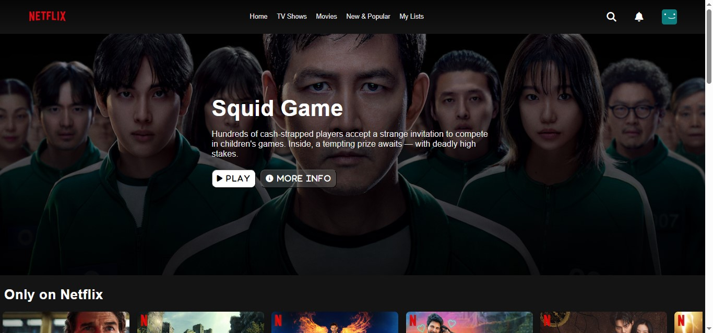
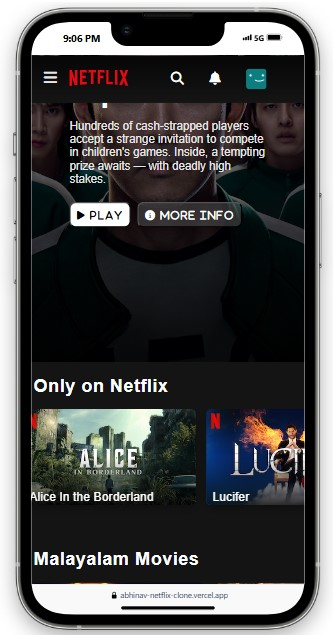
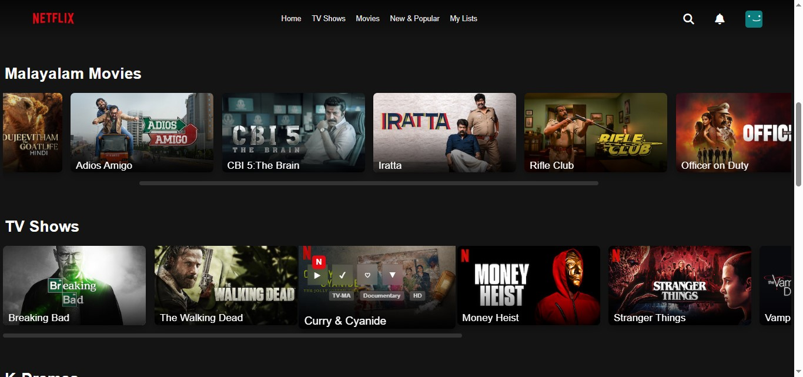
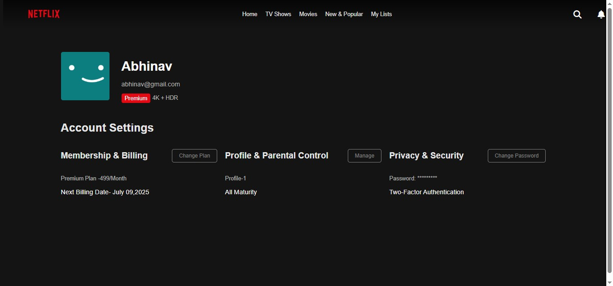
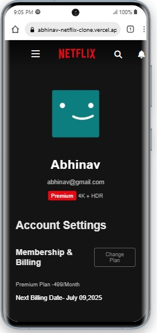

# 🎬 Netflix Clone
### 🌐 Live Demo: [Click Here to Visit the Site 🚀](https://abhinav-netflix-clone.vercel.app/)


## 🚀 Overview
This **Netflix Clone** is a fully responsive web application developed using **HTML, CSS, and JavaScript**, designed to replicate the core functionalities and visual appeal of Netflix. The project features a sleek and interactive **landing page**, where users can sign up with their email, select a language, and explore FAQs before proceeding to the **authentication page**. Upon login using predefined credentials, users are redirected to the **home page**, which consists of a dynamic **navigation bar** with sections like **Home, TV Shows, Movies, New & Popular, and My List**. The home page features various categories such as **movies, anime, TV shows, sitcoms, US TV dramas, and K-dramas**. Additionally, a **profile page** is included where users can view their **subscription plan, account settings, and preferences** and sign out seamlessly. The entire website is **fully responsive**, ensuring an optimal experience across various screen sizes and devices.This project is a demonstration of **front-end development skills**, emphasizing UI design, responsiveness, and user interaction. 🚀  

🚨 **Note:** This project is **UI-only**, meaning there is **no backend functionality** for actual streaming or user authentication.

---

## 🌟 Features
- 🎨 **Netflix-style UI** – Aesthetic design inspired by Netflix.
- 📺 **Home Page** – Showcases trending movies and shows.
- 🌟 **Fully Responsive Design** – works beautifully across all devices.
- 🏠 **Home Page** with categories like:
  - TV Shows  
  - Malayalam Movies  
  - K-Dramas  
  - Animes  
- 🔄 **Navigation Bar** – Home, TV Shows, Movies, New & Popular, My List  
- 📥 **Landing Page** – Email input to get started, language selection, FAQs  
- 🔐 ***Login Authentication**  
  - *Email*: 'abhinav@email.com'  
  - *Password*: 'abhi123' 
- 👤 **Profile Page** – View Account Info, Manage Account, Change Password, Sign Out  
- 📄 **Footer** on Landing & Home pages


---

## 🔧 Technologies Used
- **HTML5** – Structure of the website.
- **CSS3** – Styling and animations.
- **JavaScript (ES6)** – Interactive elements and responsiveness.
- **Flexbox & Grid** – Layout management for responsiveness.

---

## 📸 Screenshots

### 🌟 Login Page:


### 🌟 Home Page:


#### 🌟 Home Page(In Mobile):


### 🎥 Movie Section:


### 👤 Profile Page:


#### 👤 Profile Page(In Mobile):



---

## 🔐Authentication Credentials:

### Email: **'abhinav@email.com'**
### Password: **'abhi123'**

---

## 📦 Installation & Setup
1. **Clone the repository:**
   ```bash
   git clone https://github.com/abhinav-vr-45/Netflix-Clone

2. **Navigate into the project folder:**
    ```bash
    cd Netflix-clone

3. **Open index.html in your browser:**
   ```bash
   open index.html

---


## 🚀 Future Enhancements

### 🔗 Backend Integration – Add user authentication and streaming functionality.

### 🎥 Real Content – Connect with an API to fetch real movie data.

### 💬 User Reviews – Allow users to leave reviews and ratings.


---


## 🤝 Contributing
Contributions are welcome! If you have suggestions or improvements, feel free to fork the repository and submit a pull request.

---


## 📜 License
This project is not yet Licensed.

---


## 🙌 Acknowledgments
Inspired by the original Netflix UI & UX. This project is made purely for educational and portfolio purposes.

---


## 📬 Contact
If you have any questions or feedback, feel free to reach out:
### GitHub: [abhinav-vr](https://github.com/abhinav-vr-45)
### LinkedIn: [Abhinav V R](https://www.linkedin.com/in/abhinavvr)

---


### ⭐️ If you like this project, don’t forget to give it a star!
