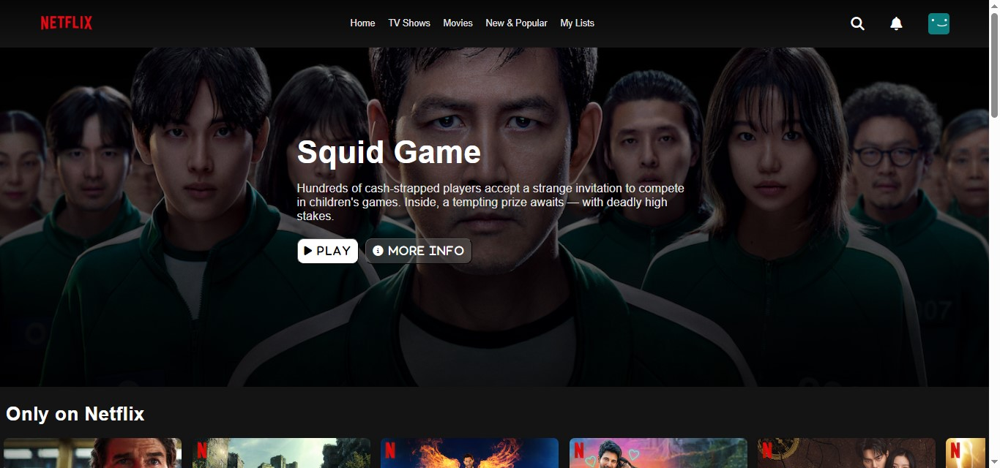
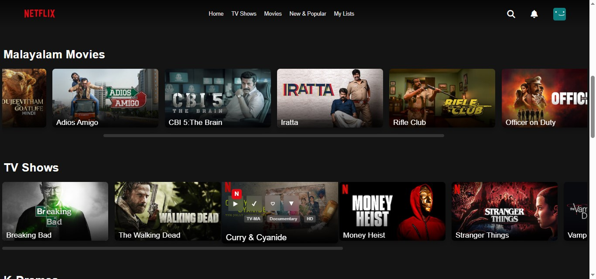
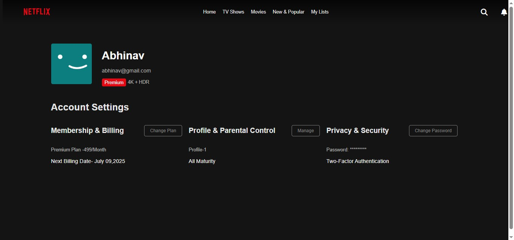

# 🎬 Netflix Clone

## 🚀 Overview
This is a **responsive Netflix clone** website designed to provide a visually appealing user interface for streaming content. The website features various categories such as **movies, anime, TV shows, sitcoms, US TV dramas, and K-dramas**. Additionally, a **profile page** is included where users can view their **subscription plan, account settings, and preferences**.

🚨 **Note:** This project is **UI-only**, meaning there is **no backend functionality** for actual streaming or user authentication.

---

## 🌟 Features
- 📺 **Home Page** – Showcases trending movies and shows.
- 🔍 **Categories** – Movies, Anime, TV Shows, Sitcoms, US TV Dramas, K-Dramas.
- 🏠 **Responsive Design** – Works seamlessly on desktop, tablet, and mobile devices.
- 👤 **Profile Page** – Displays subscription plan and account settings.
- 🎨 **Netflix-style UI** – Aesthetic design inspired by Netflix.

---

## 🔧 Technologies Used
- **HTML5** – Structure of the website.
- **CSS3** – Styling and animations.
- **JavaScript (ES6)** – Interactive elements and responsiveness.
- **Flexbox & Grid** – Layout management for responsiveness.

---

## 📸 Screenshots

### 🌟 Home Page:


### 🎥 Movie Section:


### 👤 Profile Page:


---

## 📦 Installation & Setup
1. **Clone the repository:**
   ```bash
   git clone https://github.com/your-username/netflix-clone.git
2. **Navigate into the project folder:**
    ```bash
    cd Netflix-clone
3. **Open index.html in your browser:**
   ```bash
   open index.html

## 🚀 Future Enhancements
### 🔗 Backend Integration – Add user authentication and streaming functionality.

### 🎥 Real Content – Connect with an API to fetch real movie data.

### 💬 User Reviews – Allow users to leave reviews and ratings.


## 🤝 Contributing
Contributions are welcome! If you have suggestions or improvements, feel free to fork the repository and submit a pull request.


## 📜 License
This project is not yet Licensed.


## 🙌 Acknowledgments
A huge thanks to **Devtown** for their incredible bootcamp on building a Netflix Clone! This project was made possible through their guidance, and the learning experience was truly valuable. This project is made purely for educational and portfolio purposes.


## 📬 Contact
If you have any questions or feedback, feel free to reach out:
GitHub: [abhinav-vr](github.com/abhinav-vr-45)
LinkedIn:[Abhinav V R](https://www.linkedin.com/in/abhinavvr)


### **Why This README Works**
✅ **Structured & Easy to Read**  
✅ **Includes Features, Technologies, Installation Guide**  
✅ **Future Enhancements & Contribution Guidelines**  

Feel free to **modify sections like screenshots, contact info, and GitHub links** to fit your project! 🚀🎬 Let me know if you need any improvements. 😊
